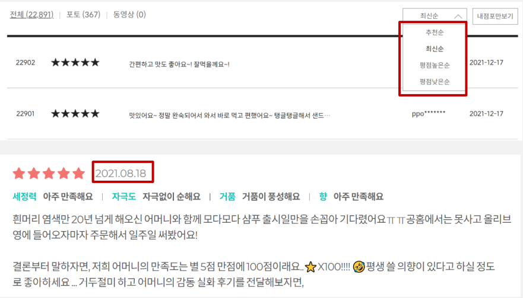
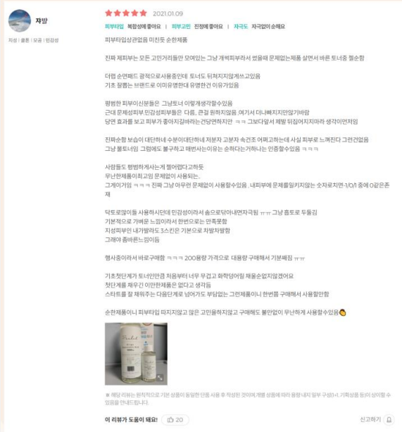
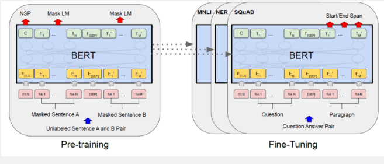
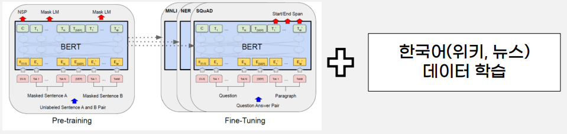

# khu_capstone

# 연구배경

- 리뷰에 대한 인식 : 소비자는 상품 구매 전 유용한 리뷰를 보고 구매하려는 경향이 크다. 이커머스 업종에서 리뷰 분석은 큰 화두
- 현 문제점 : 대부분의 이커머스 사이트는 유용한 리뷰를 필터링해주는 기능이 없고, 필터링해주는 기능이 있어도 상단에 위치한(유용한 리뷰)리뷰만 계속 유용함을 받는 비대칭 현상이 존재한다. 이에 따라 비대칭 현상으로 최근 리뷰들은 무시되는 문제점이 있다.
- 이에 따라 유용한 리뷰를 분류하는 모델을 만들어, 소비자에게 상품 구매 전 도움을 주고자 한다.

# 분석과정

전체적인 분석 과정

### 데이터수집

데이터 : 올리브영 스킨/토너 카테고리 리뷰 데이터
- 리뷰에 가장 민감한 상품군인 화장품 도메인 선택
- 화장품 중 가장 보편적인 스킨 토너 데이터 선택
- 직접 크롤링 후, 약 2000개 데이터 확보

데이터 전처리 : 
- null값 데이터 제거
- 리뷰에 판매자 및 관리자가 작성한 문구 삭제
- html 태그와 필요없는 공백 삭제

데이터 labeling : 
- 피부타입에 따른 피드백 : ex - 복합성, 지성, 건성, 예민함, 홍조, 블랙헤드, 여드름에 좋다고 해서 샀는데~, 기타 자신의 피부 설명
- 타 제품과의 비교 : A제품에 비해 끈적임이 덜 해요, B제품 쓰다가 돌아왔는데
- 화장품 정보 : 끈적여요, 크리미해요, 물같아요, 향, 제형 (용량으 제외)
- 단기 효과, 느낌 : 보습이 잘 되어요, 촉촉해요, 다음날 화장이 잘 먹어요
- 장기 효과, 경과 설명 : 전후 변화, 장기적 효과(기간이 명시된)

위 기준이 속한 개수 + 주관적 추가 정보
- 기준 0개 -> 1점
- 기준 1개 -> 1~2점
- 기준 2개 -> 2~3점
- 기준 3개 -> 3~4점
- 기준 4개 -> 4~5점
- 기준 5개 -> 5점
5점 척도로 진행 후, binary label로 변경
- 5,4,3 -> 1
- 2,1 -> 0
- 5점 척도로 점수를 매긴 뒤, 다시 2진 분류로 하면 좀 더 신뢰감 있고 정교한 labeling을 할 수 있어 위와 같이 진행함(추후 5점 척도 label로도 실험 진행 예정)
- labeling은 총 5명의 평균값을 반올림하여 진행하였다.

### 데이터 추가(Text augmentation)
선정이유)
- 한정된 시간 내에 많은 labeling을 수행할 수 없어 label 개수가 현저히 적었다.
- 데이터가 적을 때, 많은 데이터를 사용한 것과 비슷한 정확도를 만들 수 있는 기법이다.
- image data augmentation만 보편적으로 알려져 있는데, text augmentation의 효과는 어떤지 실험해보고자 했다.
참고논문  : Easy data augmentation techniques for boosting performance(2019 EMNLP)

4가지 데이터 추가 기법
- Synonym Replacement(SR) : 특정 단어를 유의어로 교체
- Random Insertion(RI) : 임의 단어 삽입
- Random Swap(RS) : 문장 내 임의 두 단어 위치 변경
- Random Deletion(RD) : 임의 단어 삭제

## 모델링 

모델1 BERT(multilingual)
선정이유)
- BERT는 기존 왼쪽에서 오른쪽으로 문맥을 파악하는 모델들의 한계점을 Mask토근과, next sentence prediction을 사용해 양방향 학습으로 개선한 특징이 있다.
- Pre-trained 모델로 Wikipedia, bookCorpus단어를 pre-trained시켜 성능을 개선하여 task에 맞게 fine-tuning하여 수월하다.
- 기존 attention을 사용해 성능을 개선한 transformer의 encoder를 적층시켜 학습을 진행한 특징이 있다.

모델2 KoBERT
선정이유)
- KoBERT는 기존 다국어 학습 모델인 BERT에서 한국어 데이터만 학습을 진행한 모델이다.
- 기존 BERT의 한국어 성능 한계를 개선하여 진행하는 프로젝트도 한국어 위주이기 때문에 KoBERT를 사용했다.

### 최적화
- AdamW : Adam을 개선한 옵티마이저로 bert model에 주로 사용하는 옵티마이저이다. 기존 L2 regularization 문제를 보완하기 위해 weight decay를 위한 텀을 따로 분리하여, 일반화 성능을 개선한 특징이 있다.
- Cosine scheduler with warmup : Pretrained model의 특성상 처음 warmup을 시켜주면 더 빠르게 학습되는 효과가 있다.

Hyper parameter tuning
- max_len : 화장품 리뷰들의 길이 분포를 파악해 256로 설정
- warmup_ratio : 0.1, 0.01, X 중 0.1이 가장 높은 성능을 나타냄
- Dr_rate : 데이터가 적어 과적합이 심하게 나 0.5, 0.1, 0.01로 측정하였고 0.5가 가장 높은 성능을 나타냄
- Weight_decay : 0.1, 0.01, X중 0.01이 가장 높은 성능을 나타냄

# 실험결과

- BERT(multi-lingual)이 KoBERT보다 성능이 높았다. 화장품 도메인의 데이터 특성이 기존 BERT에 더 적합한 것을 해석했다.
- augmentation을 적용하지 않았을 때 성능이 가장 높았다. 단어의 어순과 정보가 중요한 화장품 리뷰의 특성때문인 것으로 분석했다.
- Rd, ri, rs에서 가장 성능이 저하 되었다. 유의어로 교체하는 sr에 비해 단어의 정보를 아예 바꿔버리기 때문에 성능이 저하됐을 것으로 분석했다.

binary text classification 
acc 0.82 (max_len=64, batch_size=64, warmup_ratio=0.1, epoch=5, learning rate=5e-5)

# 결과 및 제언

결과 및 기대효과)
- 데이터 수집부터, 전처리, labeling, 모델링, 최적화 등 전체 프로세스를 다 구현하는 경험
- 유용함이라는 지표가 매우 주관적이라 labeling 기준을 최대한 객관적으로 세움.
- softmax 형태로 값을 출력해, 어느정도 유용한지 나타내고자 함.
- 앞에서 구한 softmax score를 통해 필터링 기능을 사용한다면, 상품 구매 전 소비자에게 도움을 제공

제언 및 아쉬웠던 점)
- 제한된 시간 내에 수작업 labeling 작업 때문에 많은 데이터를 확보하지 못함
- 추가실험에서 추후 군집 내 기준을 centroid값으로 추출해보고자 함
- Tf-idf기반이 아닌 sentence-bert나 doc2vec을 적용시켜 성능을 개선하고자 함
